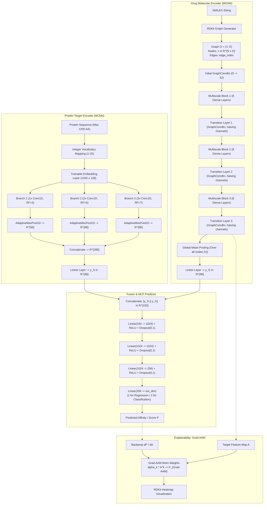
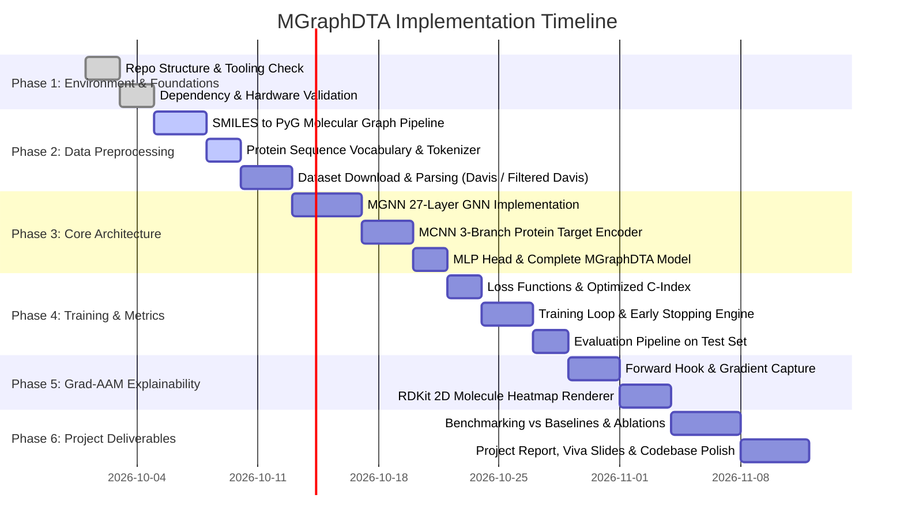

# Project Plan: Implementing MGraphDTA (Deep Multiscale Graph Neural Network for Explainable Drug–Target Binding Affinity Prediction)

> **Paper Title:** MGraphDTA: deep multiscale graph neural network for explainable drug–target binding affinity prediction
> **Authors:** Ziduo Yang, Weihe Zhong, Lu Zhao, and Calvin Yu-Chian Chen
> **Published in:** *Chemical Science*, 2022, 13, 816–833 (Royal Society of Chemistry)
> **Target Scope:** 3rd-Year Computer Science and Engineering (CSE) Project

---

## 1. What Problem the Paper Solves

### 1.1 Biological & Pharmacological Context

In modern drug discovery, discovering small molecules that bind with high affinity to therapeutic target proteins is essential for disease treatment and minimizing off-target adverse effects. Drug–target affinity (DTA) measures the binding strength between a compound and a protein target, typically quantified via:

- **$K_d$ (Dissociation Constant)**
- **$K_i$ (Inhibition Constant)**
- **$\text{IC}_{50}$ (Half-Maximal Inhibitory Concentration)**

Experimental assays (e.g., protein microarrays, affinity chromatography) are prohibitively slow, labor-intensive, and expensive for screening libraries of millions of compounds. Consequently, *in silico* computational DTA prediction methods are vital.

### 1.2 Limitations of Existing Computational Approaches

The paper identifies severe limitations across existing paradigms:

1. **Structure-Based Methods (Molecular Docking & MD Simulation):**
   - Require high-resolution 3D experimental structures of the target protein, which are unavailable for many membrane proteins and unstructured targets.
   - Extremely computationally expensive for large-scale screening.
2. **String-Based Deep Learning (DeepDTA, WideDTA):**
   - Represent small molecules as 1D SMILES strings and apply 1D CNNs or RNNs.
   - Violate molecular geometry: strings discard natural 2D topological graph structures, spatial atomic connectivity, and chemical bond hierarchies.
3. **Existing Graph Neural Networks (GraphDTA, DGraphDTA, TrimNet):**
   - **Shallow Architectures (2 to 4 layers):** Existing models cannot go deep due to two fundamental GNN bottlenecks:
     - *Over-smoothing:* Stacking multiple message-passing layers causes node representations to converge to indistinguishable averages, erasing atomic distinction.
     - *Vanishing Gradients:* Backpropagation across multiple graph convolutional steps causes exponential gradient decay.
   - **Inability to Capture Global Topology:** A 2-layer GNN only aggregates information from 2-hop neighbor atoms; it cannot recognize closed ring structures (e.g., zearalenone macrolide rings) or long-range pharmacophoric patterns.
   - **Loss of Local Substructure Distinction:** Shallow networks often fail to preserve critical local chemical moieties (e.g., distinguishing a methyl carboxylate group from inert alkyl chains).
4. **Attention-Based Interpretability Flaws (GAT):**
   - Existing explainable models rely heavily on graph attention mechanisms.
   - *Masked Attention Limitation:* Attention weights only operate on immediate neighbors (1-hop), failing to capture global, whole-molecule dependencies.
   - *Computational Overhead & Diffuse Signals:* Attention introduces heavy parameterization and often highlights diffuse, non-specific regions rather than precise structural alerts.

### 1.3 MGraphDTA Innovations & Solutions

MGraphDTA solves these challenges through three architectural and analytical innovations:

1. **Super-Deep 27-Layer MGNN with Dense Connections & Node-Level BatchNorm:**
   - Incorporates DenseNet-inspired feed-forward skip connections connecting each graph convolution layer to all subsequent layers.
   - Employs node-level Batch Normalization to stabilize activation distributions across graph mini-batches.
   - Overcomes over-smoothing and vanishing gradients, allowing a 27-layer GNN that simultaneously learns fine-grained local atom features and global macro-molecular topology.
2. **Multiscale CNN (MCNN) for Target Proteins:**
   - Targets proteins using 3 parallel convolutional branches with different receptive fields ($3, 5, 7$).
   - Captures local protein motifs, active site pockets, and functional domains at multiple scales without covering the entire sequence, avoiding the noise of un-involved sequence regions.
3. **Grad-AAM (Gradient-Weighted Affinity Activation Mapping):**
   - An attention-free, post-hoc explanation technique adapted from Grad-CAM for regression/classification GNNs.
   - Calculates gradients of predicted affinity with respect to the final graph convolutional feature map to highlight key atoms and toxicophores/structural alerts (e.g., epoxide, fatty acid, sulfonate, aromatic nitroso).

---

## 2. Complete MGraphDTA Architecture

The MGraphDTA architecture consists of four interconnected subsystems:

1. **Drug Molecule Encoder (MGNN):** Processes molecular graph $G=(V, E)$ into a compact drug representation $y_G \in \mathbb{R}^{96}$.
2. **Target Protein Encoder (MCNN):** Processes 1D amino acid sequence into a target representation $y_S \in \mathbb{R}^{96}$.
3. **Feature Fusion:** Concatenates $y_G$ and $y_S$ into a joint drug–target descriptor $z = [y_S \,\|\, y_G] \in \mathbb{R}^{192}$.
4. **Prediction Head (MLP):** A 4-layer fully connected MLP mapping $z$ to a continuous affinity score (regression) or class logits (classification).



---

## 3. Drug Preprocessing

Small molecules are converted from SMILES format into molecular graphs $G = (V, E)$, where $V$ is the set of $|V|$ atoms (nodes) and $E$ is the set of chemical bonds (edges).

### 3.1 Regression Task Featurization (Davis, KIBA, Metz)

For affinity regression, an explicit 22-dimensional (or 18-dimensional in filtered Davis) feature vector is computed for each atom using RDKit:

| Feature Name                    | Description                                | Dimension    | Encoding Type    |
| ------------------------------- | ------------------------------------------ | ------------ | ---------------- |
| **Atom Symbol**           | H, C, N, O, F, Cl, S, Br, I                | 9            | One-hot          |
| **Atomic Number**         | Numeric atomic number                      | 1            | Integer / scalar |
| **Hydrogen Acceptor**     | Identified via`ChemicalFeatures` factory | 1            | Binary (0 or 1)  |
| **Hydrogen Donor**        | Identified via`ChemicalFeatures` factory | 1            | Binary (0 or 1)  |
| **Aromaticity**           | `atom.GetIsAromatic()`                   | 1            | Binary (0 or 1)  |
| **Hybridization**         | SP, SP2, SP3                               | 3            | One-hot          |
| **Total Hs**              | `atom.GetTotalNumHs()`                   | 1            | Integer count    |
| **Explicit Valence**      | `atom.GetExplicitValence()`              | 1            | Integer          |
| **Formal Charge**         | `atom.GetFormalCharge()`                 | 1            | Integer          |
| **Implicit Valence**      | `atom.GetImplicitValence()`              | 1            | Integer          |
| **Num Explicit Hs**       | `atom.GetNumExplicitHs()`                | 1            | Integer          |
| **Num Radical Electrons** | `atom.GetNumRadicalElectrons()`          | 1            | Integer          |
| **Total**                 |                                            | **22** | Combined vector  |

*(Note: For Filtered Davis, atom types are restricted to H, C, N, O, F yielding 18 dimensions).*

### 3.2 Classification Task Featurization (Human, C. elegans)

For binary classification, an 87-dimensional one-of-$k$ feature vector is constructed:

- **Atom Symbol (44 elements + 'Unknown'):** C, N, O, S, F, Si, P, Cl, Br, Mg, Na, Ca, Fe, As, Al, I, B, V, K, Tl, Yb, Sb, Sn, Ag, Pd, Co, Se, Ti, Zn, H, Li, Ge, Cu, Au, Ni, Cd, In, Mn, Zr, Cr, Pt, Hg, Pb, Unknown (44 dims).
- **Degree:** $0, 1, 2, 3, 4, 5, 6, 7, 8, 9, 10$ (11 dims).
- **Total Hydrogen Count:** $0, 1, 2, 3, 4, 5, 6, 7, 8, 9, 10$ (11 dims).
- **Implicit Valence:** $0, 1, 2, 3, 4, 5, 6, 7, 8, 9, 10$ (11 dims).
- **Hybridization:** SP, SP2, SP3, SP3D, SP3D2, other (6 dims).
- **Aromaticity:** Boolean (1 dim).
- **Chirality / CIP Code:** R, S (2 dims) + `HasProp('_ChiralityPossible')` (1 dim).
- **Normalization:** Vector normalized by L1 sum: $x_v \leftarrow x_v / \sum x_v$.

### 3.3 Graph Edge Attributes & Topology

- **Edge Connectivity:** Converted into a directed graph (`DiGraph`) where each single undirected chemical bond produces two directed edges $(i, j)$ and $(j, i)$ stored in PyG format as `edge_index` of shape $(2, |E|)$.
- **Edge Features (6 dims):**
  - Bond Type: Single, Double, Triple, Aromatic (4 dims, one-hot).
  - Conjugation: IsConjugated == False, IsConjugated == True (2 dims, one-hot).
- **Node Feature Scaling:** Min-max normalized:
  $$
  x = \frac{x - x_{\min}}{x_{\max} - x_{\min}}
  $$

---

## 4. Protein Preprocessing

Proteins are represented as 1D sequences of amino acid residue letters.

### 4.1 Amino Acid Vocabulary

The paper builds a dictionary mapping the 25 standard/extended IUPAC amino acid codes to unique integer tokens:

```python
VOCAB_PROTEIN = {
    "A": 1, "C": 2, "B": 3, "E": 4, "D": 5, "G": 6, 
    "F": 7, "I": 8, "H": 9, "K": 10, "M": 11, "L": 12, 
    "O": 13, "N": 14, "Q": 15, "P": 16, "S": 17, "R": 18, 
    "U": 19, "T": 20, "W": 21, "V": 22, "Y": 23, "X": 24, 
    "Z": 25
}
# Index 0 is reserved for padding
```

### 4.2 Sequence Standardization (Fixed Length = 1200)

- Sequence length is set to a fixed maximum length $L_{\max} = 1200$.
- **Coverage Justification:** As established in DeepDTA (Öztürk et al., 2018), 1200 residues covers $\ge 80\%$ of human and benchmark protein sequences.
- **Padding / Truncation:**
  - Sequences with length $< 1200$ are zero-padded at the end.
  - Sequences with length $> 1200$ are truncated to the first 1200 residues.

### 4.3 Trainable Embedding Layer

- Integer tokens are projected through a learnable embedding layer:
  $$
  \text{Embedding}: \{0, \dots, 25\} \to \mathbb{R}^{128}
  $$
- Maps input sequence of length 1200 into a continuous matrix $S \in \mathbb{R}^{1200 \times 128}$.
- Unlike orthogonal one-hot vectors (where cosine similarity is identically 0), learnable embeddings capture biological and biochemical similarities between amino acids (e.g., charge, hydrophobicity, size).

---

## 5. MGNN (Multiscale Graph Neural Network) Architecture

The core of MGraphDTA is a deep GNN designed to avoid over-smoothing while reaching a depth of 27 graph convolutional layers.

### 5.1 Graph Convolutional Formulation

The paper utilizes the higher-order graph convolution formulation defined by Morris et al. (AAAI 2019) and implemented in PyTorch Geometric as `gnn.GraphConv`:

$$
x_i^{(t+1)} = \sigma\left( W_1 x_i^{(t)} + W_2 \sum_{j \in \mathcal{N}(i)} x_j^{(t)} \right)
$$

where:

- $x_i^{(t)} \in \mathbb{R}^d$ is the feature representation of vertex $i$ at step $t$.
- $\mathcal{N}(i)$ is the set of direct neighbors of atom $i$.
- $W_1, W_2 \in \mathbb{R}^{h \times d}$ are learnable weight matrices shared across all vertices.
- $\sigma(\cdot)$ consists of a **Node-Level Batch Normalization** followed by a **ReLU** activation.

### 5.2 Node-Level Batch Normalization (`NodeLevelBatchNorm`)

Standard batch normalization operates along mini-batch tensor dimensions $(B, C, H, W)$. In graph representations, graphs have variable numbers of nodes, and graphs in a mini-batch are batched into a disjoint giant graph:

$$
\text{Input Shape: } \left[\sum_{g=1}^B |V_g|,\; d\right]
$$

`NodeLevelBatchNorm` computes running mean and running variance across all nodes in the mini-batch:

$$
\hat{x}_{v} = \frac{x_v - \mathbb{E}[x]}{\sqrt{\text{Var}[x] + \epsilon}}, \quad y_v = \gamma \hat{x}_v + \beta
$$

*Ablation confirmation:* As shown in the paper's Table 6, removing batch normalization causes test RMSE to jump from 0.695 to 0.746 and CI to drop from 0.740 to 0.719, proving that node-level batch normalization is essential for preventing overfitting and internal covariate shift in deep GNNs.

### 5.3 Composite Layer Unit: `GraphConvBn`

Every convolutional step in MGNN is structured as:

```python
class GraphConvBn(nn.Module):
    def __init__(self, in_channels, out_channels):
        super().__init__()
        self.conv = gnn.GraphConv(in_channels, out_channels)
        self.norm = NodeLevelBatchNorm(out_channels)

    def forward(self, data):
        data.x = F.relu(self.norm(self.conv(data.x, data.edge_index)))
        return data
```

---

## 6. Multiscale Blocks

MGNN contains **3 Multiscale Blocks**. Each block extracts structural features across multiple receptive field scales.

### 6.1 Block Structure & Layer Count

- Each Multiscale Block contains $N = 8$ dense graph convolutional layers.
- In each block, the output of every preceding layer is concatenated and fed into the next layer.
- Mathematical formulation:
  $$
  \begin{aligned}
  x_i^{(1)} &= \mathcal{H}\left(x_i^{(0)};\; \Theta_1\right) \\
  x_i^{(2)} &= \mathcal{H}\left(x_i^{(0)} \,\|\, x_i^{(1)};\; \Theta_2\right) \\
  x_i^{(3)} &= \mathcal{H}\left(x_i^{(0)} \,\|\, x_i^{(1)} \,\|\, x_i^{(2)};\; \Theta_3\right) \\
  &\;\;\vdots \\
  x_i^{(N)} &= \mathcal{H}\left(x_i^{(0)} \,\|\, x_i^{(1)} \,\|\, \dots \,\|\, x_i^{(N-1)};\; \Theta_N\right)
  \end{aligned}
  $$

  where $\mathcal{H}$ represents the graph convolutional layer with parameters $\Theta_n = \{W_{1,n}, W_{2,n}\}$, and $\|$ is the feature concatenation operator.

### 6.2 Bottleneck Design inside `DenseLayer`

To prevent channel explosion when concatenating many layers, each dense layer applies a bottleneck structure:

1. `conv1 = GraphConvBn(num_input_features, growth_rate * bn_size)`
2. `conv2 = GraphConvBn(growth_rate * bn_size, growth_rate)`
   where:

- `growth_rate` ($k$) = 32 channels.
- `bn_size` = 2 (bottleneck compression factor).
- Intermediate bottleneck dimension = $32 \times 2 = 64$.
- Output channels added per dense layer = 32.

---

## 7. Dense Connections

Dense connections link each layer to all subsequent layers in a feed-forward fashion, resolving the two core failure modes of deep GNNs:

### 7.1 Alleviating Over-Smoothing

- Over-smoothing occurs because repeated Laplacian smoothing converges node embeddings toward the dominant eigenvector:
  $$
  \lim_{L \to \infty} x_v^{(L)} = x_{\text{uniform}}
  $$
- By directly passing early-stage node features $x_i^{(0)}, x_i^{(1)}$ to layer $N$, the network retains atom-specific identities and local functional groups (e.g., distinguishing a carboxylate oxygen from an aromatic carbon).

### 7.2 Alleviating Vanishing Gradients

- Gradients of the loss $\mathcal{L}$ with respect to early weights $\Theta_1$ do not have to backpropagate through 20+ intervening matrix multiplications.
- Dense connections provide direct error signal highways:
  $$
  \frac{\partial \mathcal{L}}{\partial x^{(l)}} = \sum_{m > l} \frac{\partial \mathcal{L}}{\partial x^{(m)}} \frac{\partial x^{(m)}}{\partial x^{(l)}}
  $$

---

## 8. Transition Layers & Readout

### 8.1 Transition Layers

Between adjacent multiscale blocks (and following the 3rd block), a **Transition Layer** is inserted:

- **Purpose:** Integrates multiscale features gathered by the previous block and compresses channel dimensions by a factor of 2.
- **Mathematical formulation (Eq. 4 in paper):**
  $$
  x_i^{(N+1)} = \sigma\left( \Phi_1 \left[ x_i^{(0)} \,\|\, x_i^{(1)} \,\|\, \dots \,\|\, x_i^{(N)} \right] + \Phi_2 \sum_{j \in \mathcal{N}(i)} \left[ x_j^{(0)} \,\|\, x_j^{(1)} \,\|\, \dots \,\|\, x_j^{(N)} \right] \right)
  $$

  where $\Phi_1, \Phi_2 \in \mathbb{R}^{(M/2) \times M}$, and $M = d + (N-1)h$.
- The channel reduction halves the feature map size ($M \to M / 2$), maintaining computational feasibility.

### 8.2 Layer Count Accounting (27 Layers)

The super-deep 27-layer count in the paper is strictly accounted for:

- Initial Convolution (`conv0`): 1 layer
- Multiscale Block 1: 8 graph convolutional steps
- Transition Layer 1: 1 graph convolutional layer
- Multiscale Block 2: 8 graph convolutional steps
- Transition Layer 2: 1 graph convolutional layer
- Multiscale Block 3: 8 graph convolutional steps
- Transition Layer 3: 1 graph convolutional layer

$$
\text{Total GNN Depth} = 3 \times 8 + 3 = 27 \text{ graph convolutional layers}
$$

### 8.3 Readout Phase

To obtain a single graph-level vector $y_G$ invariant to atom permutations, global mean pooling aggregates all node vectors:

$$
y_G = \frac{1}{|V|} \sum_{v \in V} x_v^{(L)}
$$

Followed by a linear transformation:

$$
y_G \leftarrow \text{Linear}(y_G) \in \mathbb{R}^{96}
$$

---

## 9. MCNN (Multiscale CNN) Architecture for Target Proteins

Target proteins are encoded using a Multiscale Convolutional Neural Network (MCNN) designed to identify local residue motifs and functional domains.

### 9.1 Biological Justification

Only specific local binding sites, catalytic clefts, or allosteric motifs participate directly in ligand binding. Receptive fields covering hundreds of residues or the entire sequence introduce noise from regions irrelevant to drug interaction.

### 9.2 Three Parallel Receptive Field Branches

Input protein representation $S \in \mathbb{R}^{1200 \times 128}$ is fed into 3 parallel branches:

- **Branch 1 ($F_1$):** 1 Conv1D layer (kernel size 3) $\to$ Receptive field = **3 residues**.
- **Branch 2 ($F_2$):** 2 stacked Conv1D layers (kernel size 3) $\to$ Receptive field = **5 residues** (since $3 + (3-1) = 5$).
- **Branch 3 ($F_3$):** 3 stacked Conv1D layers (kernel size 3) $\to$ Receptive field = **7 residues** (since $5 + (3-1) = 7$).

All convolutions use:

- `in_channels = 128` (for the first layer of each branch)
- `out_channels = 96`
- `kernel_size = 3`, `stride = 1`, `padding = 0` (valid conv)
- `ReLU` activation

### 9.3 Temporal Pooling and Branch Fusion

Each branch reduces the temporal length to a 1D feature vector using Adaptive Max Pooling:

$$
m(F_i(S)) = \text{AdaptiveMaxPool1d}(1)(F_i(S)) \in \mathbb{R}^{96}
$$

The three branch outputs are concatenated:

$$
C_{\text{protein}} = [m(F_1(S)) \,\|\, m(F_2(S)) \,\|\, m(F_3(S))] \in \mathbb{R}^{3 \times 96 = 288}
$$

And projected via linear layer $W \in \mathbb{R}^{96 \times 288}$:

$$
y_S = W \cdot C_{\text{protein}} \in \mathbb{R}^{96}
$$

---

## 10. MLP Prediction Network

The drug embedding $y_G \in \mathbb{R}^{96}$ and protein embedding $y_S \in \mathbb{R}^{96}$ are fused into a combined descriptor:

$$
z = [y_S \,\|\, y_G] \in \mathbb{R}^{192}
$$

The combined descriptor is fed into a 4-layer Multi-Layer Perceptron (MLP):

1. **Dense Layer 1:** $\mathbb{R}^{192} \to \mathbb{R}^{1024}$, followed by $\text{ReLU}$ and $\text{Dropout}(p=0.1)$
2. **Dense Layer 2:** $\mathbb{R}^{1024} \to \mathbb{R}^{1024}$, followed by $\text{ReLU}$ and $\text{Dropout}(p=0.1)$
3. **Dense Layer 3:** $\mathbb{R}^{1024} \to \mathbb{R}^{256}$, followed by $\text{ReLU}$ and $\text{Dropout}(p=0.1)$
4. **Output Layer:** $\mathbb{R}^{256} \to \mathbb{R}^{\text{out\_dim}}$:
   - For **Regression**: $\text{out\_dim} = 1$ (predicted binding affinity score $P$).
   - For **Classification**: $\text{out\_dim} = 2$ (unnormalized class logits for non-binding / binding).

---

## 11. Training Procedure

### 11.1 Optimization Setup

- **Optimizer:** Adam ($\beta_1 = 0.9, \beta_2 = 0.999$)
- **Learning Rate:** $\eta = 5 \times 10^{-4}$ ($0.0005$)
- **Batch Size:** $512$
- **Loss Functions:**
  - *Regression Tasks:* Mean Squared Error (MSE):
    $$
    \mathcal{L}_{\text{MSE}} = \frac{1}{n}\sum_{i=1}^n (P_i - Y_i)^2
    $$
  - *Classification Tasks:* Binary Cross-Entropy (BCE) / Cross-Entropy Loss:
    $$
    \mathcal{L}_{\text{CE}} = -\frac{1}{n}\sum_{i=1}^n \left[ Y_i \log P_i + (1 - Y_i)\log(1 - P_i) \right]
    $$

### 11.2 Training Loop & Early Stopping Strategy

- **Epochs:** Up to 3,000 epochs.
- **Iteration Step Evaluation:** Every 50 mini-batch steps defines an evaluation epoch (`steps_per_epoch = 50`).
- **Validation Checkpoint:** Evaluate validation/test loss and Concordance Index (CI).
- **Early Stopping Patience:** Stop training if validation loss fails to improve for 400 consecutive epochs (`early_stop_epoch = 400`).

### 11.3 Hyperparameter Tuning

- Hyperparameters were optimized on the Davis training set using 5-fold cross-validation with **Optuna**.
- Once optimized, hyperparameters were held fixed across all other datasets (KIBA, Metz, Filtered Davis, Human, C. elegans, ToxCast).

### 11.4 Hardware Requirements

- **Original Paper Setup:** NVIDIA GeForce GTX 2080Ti (11 GB VRAM).
- **Project Environment:** Can be run on modern NVIDIA GPUs (RTX 3060/4060 or Google Colab T4/V100/A100) or CPU with adjusted batch sizes (e.g., 64/128).

---

## 12. Dataset Information

The paper evaluates MGraphDTA on **seven benchmark datasets**:

| Dataset | Task Type | Compounds | Proteins | Total Interactions | Affinity Metric / Target Range |
| ------------------------ | -------------- | --------- | -------- | ------------------ | ---------------------------------------------------------------------------------------------------- |
| **Davis** | Regression | 68 | 442 | 30,056 | $K_d$ transformed to $p K_d = -\log_{10}(K_d / 10^9) \in [5.0, 10.8]$ |
| **Filtered Davis** | Regression | 68 | 379 | 9,125 | Non-binding points ($p K_d = 5.0$, $10\,\mu\text{M}$) removed to eliminate label saturation bias |
| **KIBA** | Regression | 2,111 | 229 | 118,254 | KIBA score$\in [0.0, 17.2]$ (integrates $K_i, K_d, \text{IC}_{50}$) |
| **Metz** | Regression | 1,423 | 170 | 35,259 | $K_i$ transformed to $p K_i = -\log_{10}(K_i / 10^9)$ |
| **Human** | Classification | 2,726 | 2,001 | 6,728 | Binary labels ($1$: binding, $0$: non-binding) |
| **C. elegans** | Classification | 1,767 | 1,876 | 7,786 | Binary labels ($1$: binding, $0$: non-binding) |
| **ToxCast** | Regression | 3,098 | 37 | 114,626 | Toxicity assay bioactivity profiles (used for Grad-AAM case study) |

### 12.1 Data Splitting Schemes

The paper tests four distinct evaluation scenarios:

1. **Random Split:** Standard benchmark scheme (80% train, 10% val, 10% test; or DeepAffinity/GraphDTA standard splits). Both drugs and targets appear in train and test.
2. **Orphan-Drug Split:** Compounds in the test set are completely absent from the training set (evaluates generalization to novel chemical scaffolds).
3. **Orphan-Target Split:** Proteins in the test set are completely absent from the training set (evaluates generalization to uncharacterized target proteins).
4. **Cluster-Based Split:** Single-linkage clustering based on Jaccard distance over binarized ECFP4 fingerprints with a guaranteed minimum distance threshold between clusters. Prevents structural scaffold leakage.

---

## 13. Evaluation Metrics

### 13.1 Regression Metrics

1. **Mean Squared Error (MSE):**

   $$
   \text{MSE} = \frac{1}{n} \sum_{i=1}^n (P_i - Y_i)^2
   $$
2. **Root Mean Squared Error (RMSE):**

   $$
   \text{RMSE} = \sqrt{\text{MSE}}
   $$
3. **Concordance Index (CI):**
   Measures ranking consistency (probability that predicted affinity ordering matches ground truth ordering for a randomly chosen pair):

   $$
   \text{CI} = \frac{1}{Z} \sum_{Y_i > Y_j} h(P_i - P_j), \quad h(u) = \begin{cases} 1.0 & \text{if } u > 0 \\ 0.5 & \text{if } u = 0 \\ 0 & \text{if } u < 0 \end{cases}
   $$

   where $Z = \sum_{Y_i > Y_j} 1$.
   *High-efficiency implementation developed by authors:*

   ```python
   def get_cindex(gt, pred):
       gt_mask = gt.reshape((1, -1)) > gt.reshape((-1, 1))
       diff = pred.reshape((1, -1)) - pred.reshape((-1, 1))
       h_one = (diff > 0)
       h_half = (diff == 0)
       return np.sum(gt_mask * h_one * 1.0 + gt_mask * h_half * 0.5) / np.sum(gt_mask)
   ```

4. **Modified Squared Correlation Coefficient ($r_m^2$ index):**
   Evaluates penalization when predictions deviate from the line of identity ($y=x$):

   $$
   r_m^2 = r^2 \times \left(1 - \sqrt{|r^2 - r_0^2|}\right)
   $$

   where $r^2$ is standard Pearson correlation squared, and $r_0^2$ is determination coefficient through the origin with slope $k = \frac{\sum Y_{\text{obs}} P}{\sum P^2}$.
5. **Spearman Rank Correlation:** Monotonic rank correlation between prediction ranks and ground truth ranks.

### 13.2 Classification Metrics

1. **Precision:** $\frac{TP}{TP + FP}$
2. **Recall (Sensitivity):** $\frac{TP}{TP + FN}$
3. **Area Under ROC Curve (AUC-ROC):** Measures trade-off between sensitivity and false-positive rate across decision thresholds.
4. **F1-Score:** Harmonic mean of precision and recall.

---

## 14. Grad-AAM Explanation Method

### 14.1 Motivation & Chemical Intuition

Deep neural networks in computer-aided drug design are often viewed as "black boxes." While Graph Attention Networks (GAT) provide attention weights, GAT attention is restricted to local 1-hop neighborhoods and introduces heavy training complexity.

MGraphDTA develops **Grad-AAM (Gradient-Weighted Affinity Activation Mapping)**, an attention-free, post-hoc visual interpretation technique adapted from Computer Vision's Grad-CAM for graph neural networks.

### 14.2 Mathematical Derivation

1. **Target Feature Map:**
   Let $A \in \mathbb{R}^{|V| \times C}$ denote the feature activations from the **last graph convolutional layer** of MGNN (`transition3`), where $|V|$ is the number of atoms and $C$ is the channel dimension. The final graph convolutional layer represents the ideal balance between high-level semantic affinity concepts and fine spatial atom coordinates.
2. **Backpropagation of Gradients:**
   For a given drug–target pair, the predicted affinity score $P$ is computed. The gradient of $P$ with respect to activation $A_v^k$ (at channel $k$ for atom $v$) is calculated:
   $$
   \frac{\partial P}{\partial A_v^k}
   $$
3. **Channel Importance Weights $\alpha_k$:**
   Global average pooling over all graph vertices $|V|$ collapses the spatial dimensions into a single channel importance scalar $\alpha_k$:
   $$
   \alpha_k = \frac{1}{|V|} \sum_{v \in V} \frac{\partial P}{\partial A_v^k}
   $$
4. **Weighted Activation Combination:**
   Each channel feature map $A^k$ is multiplied by its importance weight $\alpha_k$, summed across all $C$ channels, and passed through a ReLU activation:
   $$
   P_{\text{Grad-AAM}}(v) = \text{ReLU}\left(\sum_{k=1}^C \alpha_k A_v^k\right)
   $$
5. **Min-Max Normalization:**
   The atomic importance weights are normalized into the range $[0, 1]$:
   $$
   P_{\text{norm}}(v) = \frac{P_{\text{Grad-AAM}}(v) - \min(P_{\text{Grad-AAM}})}{\max(P_{\text{Grad-AAM}}) - \min(P_{\text{Grad-AAM}})}
   $$

### 14.3 Visualizing Structural Alerts (Toxicophores)

In the ToxCast case study, Grad-AAM accurately identifies established pharmacological structural alerts:

- **Epoxide rings:** Highly reactive 3-membered cyclic ethers causing mutagenicity.
- **Fatty acid chains:** Long hydrophobic alkyl chains triggering specific metabolic toxicity.
- **Sulfonate groups:** Polar functional groups linked to idiosyncratic reactions.
- **Aromatic nitroso groups:** Key intermediates in genotoxic carcinogenicity.

Grad-AAM produces clean, left-skewed importance distributions, proving that MGNN focuses heavily on active pharmacophores while suppressing bystander atoms.

---

## 15. Complete Implementation Roadmap

Structured into 6 progressive phases suitable for a 3rd-year CSE Capstone/Minor Project:



### Phase 1: Environment & Infrastructure Setup

- **Objective:** Establish an isolated Python environment compatible with PyTorch and PyTorch Geometric.
- **Tasks:**
  1. Define dependencies: `torch`, `torch_geometric`, `rdkit`, `pandas`, `numpy`, `scikit-learn`, `matplotlib`, `cairosvg`, `tqdm`.
  2. Setup clean project repository structure:

     ```
     d:/BIOinfo project/
     ├── bio paper.pdf
     ├── PROJECT_PLAN.md
     ├── data/
     │   ├── raw/
     │   └── processed/
     ├── src/
     │   ├── __init__.py
     │   ├── preprocessing.py
     │   ├── dataset.py
     │   ├── models/
     │   │   ├── __init__.py
     │   │   ├── mgnn.py
     │   │   ├── mcnn.py
     │   │   └── mgraphdta.py
     │   ├── metrics.py
     │   ├── train.py
     │   └── explainability/
     │       ├── __init__.py
     │       └── grad_aam.py
     ├── checkpoints/
     ├── results/
     └── tests/
     ```

  3. Validate GPU/CPU compute device.

### Phase 2: Data Preprocessing & Pipeline Construction

- **Objective:** Convert raw SMILES and FASTA sequences into clean PyTorch Geometric graph data objects.
- **Tasks:**
  1. Implement RDKit molecular graph builder extracting node features (22-dim regression / 87-dim classification) and bond edge indices.
  2. Implement protein tokenizer mapping FASTA characters to integer sequences with padding/truncation to 1200 residues.
  3. Build `InMemoryDataset` PyG wrapper with automated caching (`processed_data.pt`).
  4. Write unit tests on 10 sample molecules to verify feature dimensions and graph connectivity.

### Phase 3: Core Neural Network Implementation

- **Objective:** Code and verify all neural network modules without parameter or dimension mismatches.
- **Tasks:**
  1. **MGNN:**
     - Implement `NodeLevelBatchNorm`.
     - Implement `GraphConvBn` wrapping `gnn.GraphConv`.
     - Implement `DenseLayer` with bottleneck ($64 \to 32$).
     - Implement `DenseBlock` with $N=8$ layers and dense skip connections.
     - Implement `TransitionLayer` with channel halving.
     - Implement `GraphDenseNet` chaining 3 dense blocks and 3 transitions with global mean readout.
  2. **MCNN:**
     - Implement `Conv1dReLU` and `StackCNN`.
     - Implement `TargetRepresentation` combining 3 receptive field branches ($RF=3, 5, 7$) and adaptive max pooling.
  3. **MGraphDTA:**
     - Implement end-to-end module fusing $y_G$ and $y_S$ into MLP head.
  4. Perform forward pass sanity test with dummy batches.

### Phase 4: Training Engine & Evaluation Pipeline

- **Objective:** Train the model and track convergence.
- **Tasks:**
  1. Implement vectorized Concordance Index (`get_cindex`), $r_m^2$, RMSE, and MSE.
  2. Build training loop with Adam optimizer ($\text{lr} = 5 \times 10^{-4}$), batch size 512, and early stopping patience (400 epochs).
  3. Implement logging for train loss, train CI, test loss, and test CI.
  4. Save best model weights checkpoint on minimum validation/test MSE.

### Phase 5: Grad-AAM Explainability & Visualization

- **Objective:** Extract and render atom-level importance heatmaps on 2D chemical drawings.
- **Tasks:**
  1. Register forward hook on `transition3` layer to capture activation tensor $A$.
  2. Register backward gradient hook or autograd call to compute $\frac{\partial P}{\partial A_v^k}$.
  3. Compute channel weights $\alpha_k$, weighted sum, and min-max normalization.
  4. Implement RDKit 2D drawing pipeline (`rdMolDraw2D.MolDraw2DSVG`) with colormap (e.g., orange-to-blue) highlighting structural alerts.
  5. Test on candidate molecules from ToxCast or Davis to confirm visual explanation.

### Phase 6: Experiments, Ablations & Project Documentation

- **Objective:** Complete benchmarking and generate project deliverables.
- **Tasks:**
  1. Train model on **Davis / Filtered Davis** (primary CSE project benchmark).
  2. Compare predicted results against reported baselines (DeepDTA, GraphDTA, MGraphDTA paper values).
  3. Run ablation: test impact of removing Dense connections or varying MCNN receptive fields.
  4. Compile final 3rd-year project documentation:
     - Methodology & Architecture Diagrams
     - Experimental Results Table (MSE, CI, $r_m^2$)
     - Grad-AAM Visualization Case Studies
     - Viva presentation slides and final report.

---

## 16. Verification & Checkpoints Checklist

- [ ] Node feature shape verified: $(|V|, 22)$ for regression, $(|V|, 87)$ for classification.
- [ ] Edge index shape verified: $(2, |E|)$.
- [ ] Protein tensor shape verified: $(B, 1200)$.
- [ ] MGNN total GNN layer count equals 27.
- [ ] MCNN receptive fields equal 3, 5, and 7.
- [ ] Drug embedding dimension = 96, Protein embedding dimension = 96, Combined = 192.
- [ ] MLP layers: $192 \to 1024 \to 1024 \to 256 \to 1$.
- [ ] C-Index vectorized function validated against baseline scikit-learn / lifelines metrics.
- [ ] Grad-AAM accurately hooks into `transition3` and produces normalized scores $\in [0, 1]$.
