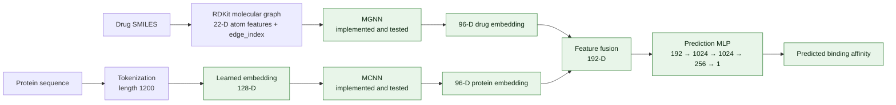

# MGraphDTA

**Drug–target binding affinity prediction with multiscale graph and convolutional neural networks.**

Original paper: **“MGraphDTA: Deep Multiscale Graph Neural Network for Explainable Drug–Target Binding Affinity Prediction”** by Ziduo Yang, Weihe Zhong, Lu Zhao, and Calvin Yu-Chian Chen, *Chemical Science* (2022), 13, 816–833. [Paper DOI](https://doi.org/10.1039/D1SC05095E).

This project predicts continuous drug–target binding affinity from a drug's SMILES representation and a target protein sequence. It implements the full MGraphDTA architecture, a Davis training pipeline, evaluation metrics, and a Grad-AAM explainability workflow.

> **Current status:** The full MGraphDTA integration, training pipeline, evaluation metrics, and Grad-AAM workflow are implemented and tested. The current Davis result is a single-seed run with a 90/10 train-validation split, batch size 32, 50 optimizer steps per epoch, and a manual stop at epoch 112. It does not claim exact reproduction of the original paper’s repeated-experiment protocol.

## Project Overview

The forward workflow has two input branches:

- **Drug:** SMILES → RDKit molecular graph → MGNN → 96-dimensional drug embedding.
- **Protein:** amino-acid sequence → integer tokens → learned 128-dimensional embedding → MCNN → 96-dimensional protein embedding.

The embeddings are concatenated and passed to the regression head, which returns one predicted affinity per drug–target pair. The current project reflects the verified Davis implementation rather than an exact paper reproduction.

## Current Status

| Component | Status | Repository evidence |
| --- | --- | --- |
| Project setup | ✅ Completed | Python dependencies and environment-check script are present. |
| Davis preprocessing | ✅ Completed | Davis tables and pKd conversion are implemented; the local dataset verification script passes. Dataset files are not committed. |
| Molecular graph construction | ✅ Completed | RDKit parsing, 22-dimensional atom features, and bidirected `edge_index` construction are implemented and passed to MGNN through PyG data. |
| 22-dimensional atom features | ✅ Completed | Feature extraction and tests are implemented; tests pass. |
| MGNN drug encoder | ✅ Completed | Encoder is implemented; shape, depth-accounting, batching, and forward tests pass. |
| MCNN protein encoder | ✅ Completed | Encoder is implemented; branch shapes, pooling, gradients, batching, and available-device tests pass. |
| MGNN tests | ✅ Completed | `tests/test_mgnn.py` passes locally. |
| MCNN tests | ✅ Completed | `tests/test_mcnn.py` passes locally. |
| Full MGraphDTA integration | ✅ Completed | `src/models/mgraphdta.py` connects MGNN, MCNN, and the regression head; end-to-end tests pass. |
| Prediction network | ✅ Completed | `192 → 1024 → 1024 → 256 → 1`, with ReLU and dropout 0.1 after each hidden layer. |
| End-to-end MGraphDTA tests | ✅ Completed | `tests/test_mgraphdta.py` verifies forward passes, dimensions, finite outputs, gradients, and CUDA when available. |
| Training pipeline | ✅ Completed | Includes train/validation split, optimization, validation, early stopping, best-checkpoint saving/restoration, epoch-level MSE history, training curve generation, and independent final test evaluation. |
| Training protocol tests | ✅ Completed | `tests/test_training.py` verifies reproducible split indices, validation-driven checkpointing/stopping, test isolation, final test evaluation, and CPU/CUDA paths. |
| Davis training (current verified run) | ✅ Completed | `python -m src.train --epochs 150 --steps-per-epoch 50 --batch-size 32 --learning-rate 0.0005 --patience 30 --validation-fraction 0.1 --seed 42 --device cuda`; the run reached epoch 112 before manual stop; best validation epoch = 91; best validation MSE = 0.23236284946015257. |
| Independent Davis test evaluation | ✅ Completed | Using the best checkpoint from epoch 91: MSE = 0.2570411052920772, RMSE = 0.5069922142322081, CI = 0.8790452402222367, `r_m^2` = 0.6817055902984536. |
| Evaluation metrics | ✅ Completed | `src/metrics.py` implements MSE, RMSE, CI, and the corrected `r_m^2` calculation matching the authors' definition; tests pass. |
| Grad-AAM | ✅ Completed | `src/explainability/grad_aam.py` implements Grad-AAM on `model.drug_encoder.transition3`; tests pass. |
| Grad-AAM visualization | ✅ Completed | A Davis visualization script is implemented; five examples were generated and verified, highlighting important drug atoms for the prediction. |
| Experiments and ablations | ⏳ Planned | No systematic ablation study has been performed yet. |
| Paper reproduction | ⚠️ Not claimed | The current project uses one seed, a 90/10 train-validation split, batch size 32, 50 optimizer steps per epoch, max 150 epochs, patience 30, and a manual stop at epoch 112; it does not claim exact paper reproduction. |

The repository implements the complete forward pass, training workflow, evaluation metrics, and Grad-AAM visualization for the current Davis setup. This run is not an exact paper reproduction: the paper reports mean ± standard deviation over repeated experiments and uses its own hyperparameter optimization and cross-validation protocol.

## Architecture

The complete model forward path, Davis training pipeline, evaluation metrics, and Grad-AAM workflow are implemented. The current project reflects a single-seed Davis run; broader ablations remain planned.



## Davis Dataset

Davis preprocessing converts measured $K_d$ values in nanomolar units to pKd using $pK_d = 9 - \log_{10}(K_d\text{ in nM})$. The local verification test currently confirms:

- 30,056 drug–target interactions
- 68 unique compounds
- 442 target IDs
- 379 unique protein sequences
- Protein token sequences padded or truncated to 1,200 positions

The raw dataset and processed CSVs are gitignored and are not included in this repository. `src/dataset.py` expects the raw Davis files under `data/raw/davis/` (including the affinity matrix and fold files). Provide the dataset locally before running `tests/test_davis_dataset.py`; no data-download workflow is included.

### Train/Validation/Test Protocol

The provided Davis training folds are flattened into 25,046 training interactions; the independent fold contains 5,010 test interactions. Training splits only the training dataset into a 90% optimization subset and a 10% validation subset (configurable with `--validation-fraction`, default `0.1`; default seed `42`). The validation subset selects checkpoints and controls early stopping. The best checkpoint is restored before the independent test dataset is loaded and evaluated once; test examples are not used by optimization or model selection.

This is the project's protocol, not an exact reproduction of the paper's six-part cross-validation protocol or the authors' released regression trainer. The released trainer evaluates its test dataset during training; this project deliberately keeps its independent test fold isolated.

Each `DavisDataset` item includes a PyTorch Geometric `pyg_data` object containing `x` (atom features shaped `[number_of_atoms, 22]`), `edge_index`, `target` (protein tokens shaped `[1, 1200]`), and `y` (affinity target). PyG batches these into a combined node matrix and edge list, a graph-membership `batch` vector, protein tokens shaped `[B, 1200]`, and labels. `MGraphDTA` consumes these fields directly.

## Drug Representation

Each SMILES string is parsed with RDKit. Atoms become graph nodes with 22 features, and every undirected chemical bond becomes two directed connections in `edge_index`.

The atom feature vector contains:

- 9-way atom-symbol one-hot encoding: H, C, N, O, F, Cl, S, Br, I
- Atomic number
- Hydrogen acceptor and donor flags
- Aromaticity
- 3-way hybridization one-hot encoding: SP, SP2, SP3
- Total hydrogen count, explicit valence, formal charge, implicit valence, explicit hydrogen count, and radical electron count

Bond-type and bond-attribute feature tensors are not currently returned by `extract_graph_structure`.

## MGNN Drug Encoder

The implemented MGNN accepts node features with shape `[number_of_atoms, 22]` and produces a 96-dimensional graph embedding. Its stages are:

- Initial graph convolution: `22 → 32`
- Three densely connected multiscale blocks, each with 8 DenseLayer units
- Growth rate 32; bottleneck size `bn_size=2` (intermediate width 64)
- A graph-convolution transition after every block, halving channel width
- Global mean pooling across molecular nodes, followed by a linear projection to 96 dimensions

Depth is reported at three distinct counting levels for the same implementation: 27 paper-reported architectural units (24 DenseLayer units plus 3 transitions), 28 top-level stages when `conv0` is included, and 52 literal `GraphConv` modules because each DenseLayer unit contains two graph convolutions. MGNN component tests pass locally, including variable-size molecules and batched graphs.

## MCNN Protein Encoder

The implemented MCNN accepts integer protein tokens shaped `[B, 1200]`. A trainable embedding with padding index 0 maps each token to 128 dimensions. The result is permuted to Conv1D layout `[B, 128, 1200]` and passed to three parallel branches:

| Branch | Conv1D layers | Kernel / stride / padding | Channels | Length before pooling |
| --- | ---: | --- | ---: | ---: |
| 1 | 1 | 3 / 1 / 0 | 96 | 1198 |
| 2 | 2 | 3 / 1 / 0 | 96 | 1196 |
| 3 | 3 | 3 / 1 / 0 | 96 | 1194 |

Each convolution is followed by ReLU. Adaptive max pooling reduces each branch to `[B, 96]`; concatenation yields `[B, 288]`, then `Linear(288, 96)` produces the protein embedding `[B, 96]`. MCNN has no batch normalization.

**Paper and released-code distinction:** The paper describes branch feature maps symbolically with sequence length 1,200, but does not explicitly specify convolution padding. The authors' released implementation omits the padding argument, so PyTorch uses `padding=0`; its actual branch lengths are 1198, 1196, and 1194 before pooling. This project follows the released implementation and does not attribute `padding=0` to an explicit paper setting.

## Integrated Prediction Model

`src/models/mgraphdta.py` concatenates the 96-dimensional protein embedding before the 96-dimensional drug embedding to form a `[B, 192]` joint representation. Its regression head is:

```text
192 → 1024 → 1024 → 256 → 1
```

Each hidden linear layer is followed by ReLU and dropout with probability 0.1. The final layer returns one scalar per input pair. These dimensions agree with the authors' [released regression implementation](https://github.com/guaguabujianle/MGraphDTA/blob/dev/regression/model.py). The paper describes a multilayer perceptron with ReLU and 0.1 dropout; the released implementation supplies the numeric widths.

## Installation

The checked project environment uses Python 3.12, PyTorch 2.6.0 with CUDA 12.4, PyTorch Geometric 2.8.0, and RDKit 2026.03.6. The exact package pins are in `requirements.txt`; its PyTorch packages are CUDA 12.4 builds.

```powershell
py -3.12 -m venv .venv
.\.venv\Scripts\Activate.ps1
python -m pip install --upgrade pip
python -m pip install -r requirements.txt
```

If pip cannot find the CUDA-specific PyTorch wheels through its configured package index, install the pinned PyTorch packages from the CUDA 12.4 wheel index first, then install the remaining requirements. A working NVIDIA driver is required for CUDA; the training code also supports CPU.

For a CUDA 12.4 environment, the explicit PyTorch installation is:

```powershell
python -m pip install torch==2.6.0+cu124 torchvision==0.21.0+cu124 torchaudio==2.6.0+cu124 --index-url https://download.pytorch.org/whl/cu124
python -m pip install -r requirements.txt
```

The raw Davis files and processed tables are ignored by Git. Provide `data/raw/davis/ligands_can.txt`, `proteins.txt`, `Y`, and the two files under `folds/` before running Davis data tests or training. Processed CSV tables are generated by `src/dataset.py` when needed.

## Training

Run the current verified Davis training command from the repository root:

```powershell
python -m src.train --epochs 150 --steps-per-epoch 50 --batch-size 32 --learning-rate 0.0005 --patience 30 --validation-fraction 0.1 --seed 42 --device cuda
```

This run uses Adam and MSE. Each epoch contains 50 optimizer updates. The 25,046-row Davis training fold is split into optimization and validation subsets (90%/10%); validation MSE selects the checkpoint and controls early stopping. The best checkpoint is restored before the independent 5,010-row test set is loaded for final evaluation. The test set is not used during optimization, checkpoint selection, or early stopping.

The current project uses a single seed, a 90/10 split, batch size 32, a 150-epoch cap, and patience 30. The run was manually stopped at epoch 112. This is not an exact reproduction of the original paper, which reports mean ± standard deviation over repeated experiments and uses its own hyperparameter optimization and cross-validation protocol.

Each epoch reports training and validation MSE. A completed training run writes `results/davis/training_history.csv`, `results/davis/training_curve.png`, and `results/davis/final_metrics.json`; these generated outputs are ignored by Git. The JSON includes the restored best-validation checkpoint's independent test MSE after final evaluation.

### Current Verified Davis Run

The verified run reached epoch 112 before manual termination and achieved:

| Metric | Verified result |
| --- | ---: |
| Best validation epoch | 91 |
| Best validation MSE | 0.23236284946015257 |
| Independent test MSE | 0.2570411052920772 |
| Independent test RMSE | 0.5069922142322081 |
| Independent test CI | 0.8790452402222367 |
| Independent test `r_m^2` | 0.6817055902984536 |

These numbers are the current verified project results for the implemented single-seed Davis protocol, not a claim that the original paper was exactly reproduced.

## Tests

The test suite covers:

| Test | What it verifies |
| --- | --- |
| `tests/test_atom_features.py` | 22-dimensional atom feature shapes and finite values for representative molecules and available Davis ligands. |
| `tests/test_davis_dataset.py` | Davis interaction count, SMILES parsing, variable-edge PyG batching, protein tensor length, affinity values, and unique compound/target counts. Requires local Davis data. |
| `tests/test_mgnn.py` | MGNN depth accounting, stage widths, individual and batched forward passes, output dimensions, finite values, and CUDA when available. |
| `tests/test_mcnn.py` | MCNN embedding and branch tensor shapes, pooling and fusion dimensions, preprocessing lengths, gradient flow, batch processing, and CUDA when available. |
| `tests/test_mgraphdta.py` | End-to-end forward pass for one and batched Davis samples, encoder/fusion dimensions, scalar output, finite values, gradients, and CUDA when available. |
| `tests/test_training.py` | Train/validation partition determinism and exclusivity, validation-based checkpoint/early stopping, training history/curve/metrics outputs, test isolation/final evaluation order, and CPU/CUDA smoke tests. |

Run the scripts from the repository root in PowerShell:

```powershell
.\.venv\Scripts\python.exe tests\test_atom_features.py
.\.venv\Scripts\python.exe tests\test_davis_dataset.py
.\.venv\Scripts\python.exe tests\test_mgnn.py
.\.venv\Scripts\python.exe tests\test_mcnn.py
.\.venv\Scripts\python.exe tests\test_mgraphdta.py
```

The training tests use pytest-style test functions. Install pytest if it is not already available, then run:

```powershell
python -m pip install pytest
python -m pytest tests\test_training.py
```

Davis tests require the local data files. CUDA checks run only when the selected PyTorch environment can access CUDA.

## Repository Structure

This tree lists tracked project files. Local raw/processed dataset files and the research-paper PDF are ignored by Git and are not included in a clone.

```text
MGraphDTA/
├── .gitignore
├── README.md
├── PROJECT_PLAN.md
├── PROJECT_PLAN.pdf
├── requirements.txt
├── checkpoints/
│   └── .gitkeep
├── results/
│   └── .gitkeep
├── scripts/
│   └── check_environment.py
├── src/
│   ├── __init__.py
│   ├── dataset.py
│   ├── preprocessing.py
│   ├── metrics.py
│   ├── train.py
│   ├── explainability/
│   │   ├── __init__.py
│   │   └── grad_aam.py
│   └── models/
│       ├── __init__.py
│       ├── mcnn.py
│       ├── mgnn.py
│       └── mgraphdta.py
└── tests/
    ├── __init__.py
    ├── test_atom_features.py
    ├── test_davis_dataset.py
    ├── test_mcnn.py
    ├── test_mgnn.py
    ├── test_mgraphdta.py
    └── test_training.py
```

## Future Work

- Run systematic ablation experiments and document the resulting protocol and comparisons.
- Extend the current single-seed Davis setup with additional protocol checks and benchmark reporting as needed.
- Keep the training and evaluation protocol aligned with any future paper-level reproduction effort.

The current project is a verified single-seed Davis implementation, not an exact reproduction of the original paper’s repeated-experiment protocol or reported mean ± standard deviation results.

## References

- Yang, Z., Zhong, W., Zhao, L., and Chen, C. Y.-C. “MGraphDTA: Deep Multiscale Graph Neural Network for Explainable Drug–Target Binding Affinity Prediction.” *Chemical Science*, 2022, 13, 816–833. [Paper](https://doi.org/10.1039/D1SC05095E).
- Authors' released implementation: [guaguabujianle/MGraphDTA](https://github.com/guaguabujianle/MGraphDTA).
