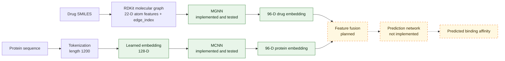

# MGraphDTA

**Academic implementation of:**

> “MGraphDTA: deep multiscale graph neural network for explainable drug–target binding affinity prediction”

This repository is an academic implementation of the 2022 MGraphDTA research paper. The intended system predicts drug–target binding affinity from molecular graphs and protein sequences, then uses Grad-AAM to explain atom-level contributions. Development is ongoing; the complete prediction pipeline is not integrated yet.

> **Current status:** The MGNN drug encoder and MCNN protein encoder are implemented and their component tests pass. Dataset-to-model integration, the combined prediction model, training, and evaluation are still to come.

## Project Overview

The planned workflow has two input branches:

- **Drug:** SMILES → RDKit molecular graph → MGNN → 96-dimensional drug embedding.
- **Protein:** amino-acid sequence → integer tokens → learned 128-dimensional embedding → MCNN → 96-dimensional protein embedding.

The embeddings are intended to feed a prediction network that estimates binding affinity. That combined model and prediction step have not been implemented yet.

## Current Status

| Component | Status | Repository evidence |
|---|---|---|
| Project setup | ✅ Completed | Python dependencies and environment-check script are present. |
| Davis preprocessing | ✅ Completed | Davis tables and pKd conversion are implemented; the local dataset verification script passes. Dataset files are not committed. |
| Molecular graph construction | ✅ Completed | RDKit parsing, 22-dimensional atom features, and bidirected `edge_index` construction are implemented. Dataset-to-model handoff still needs integration. |
| 22-dimensional atom features | ✅ Completed | Feature extraction and tests are implemented; tests pass. |
| MGNN drug encoder | ✅ Completed | Encoder is implemented; shape, depth-accounting, batching, and forward tests pass. |
| MCNN protein encoder | ✅ Completed | Encoder is implemented; branch shapes, pooling, gradients, batching, and available-device tests pass. |
| MGNN tests | ✅ Completed | `tests/test_mgnn.py` passes locally. |
| MCNN tests | ✅ Completed | `tests/test_mcnn.py` passes locally. |
| Full MGraphDTA integration | 🔄 Current / next | `src/models/mgraphdta.py` is currently a module description only. `DavisDataset`'s `pyg_data` also does not yet include node features `x`, which MGNN requires. |
| Prediction network | ⏳ Planned | Not implemented. |
| Training | ⏳ Planned | `src/train.py` currently contains only a module description. |
| Evaluation metrics | ⏳ Planned | `src/metrics.py` currently contains only a module description. |
| Grad-AAM | ⏳ Planned | `src/explainability/grad_aam.py` currently contains only a module description. |
| Experiments and ablations | ⏳ Planned | No project training experiments are implemented or reported. |
| Comparison with paper results | ⏳ Planned | No reproduction or benchmark results are claimed. |

No model training results, accuracy metrics, benchmark scores, or paper-reproduction results are reported by this repository at this stage.

## Architecture

Solid-path encoders are implemented and tested. Dashed-path components are not implemented yet.



## Davis Dataset

Davis preprocessing converts measured $K_d$ values in nanomolar units to pKd using $pK_d = 9 - \log_{10}(K_d\text{ in nM})$. The local verification test currently confirms:

- 30,056 drug–target interactions
- 68 unique compounds
- 442 target IDs
- 379 unique protein sequences
- Protein token sequences padded or truncated to 1,200 positions

The raw dataset and processed CSVs are gitignored and are not included in this repository. `src/dataset.py` expects the raw Davis files under `data/raw/davis/` (including the affinity matrix and fold files). Provide the dataset locally before running `tests/test_davis_dataset.py`; no data-download workflow is included.

## Drug Representation

Each SMILES string is parsed with RDKit. Atoms become graph nodes with 22 features, and every undirected chemical bond becomes two directed connections in `edge_index`.

The atom feature vector contains:

- 9-way atom-symbol one-hot encoding: H, C, N, O, F, Cl, S, Br, I
- Atomic number
- Hydrogen acceptor and donor flags
- Aromaticity
- 3-way hybridization one-hot encoding: SP, SP2, SP3
- Total hydrogen count, explicit valence, formal charge, implicit valence, explicit hydrogen count, and radical electron count

Bond-type and bond-attribute feature tensors are not currently returned by `extract_graph_structure`.

## MGNN Drug Encoder

The implemented MGNN accepts node features with shape `[number_of_atoms, 22]` and produces a 96-dimensional graph embedding. Its stages are:

- Initial graph convolution: `22 → 32`
- Three densely connected multiscale blocks, each with 8 DenseLayer units
- Growth rate 32; bottleneck size `bn_size=2` (intermediate width 64)
- A graph-convolution transition after every block, halving channel width
- Global mean pooling across molecular nodes, followed by a linear projection to 96 dimensions

Depth is reported at three distinct counting levels for the same implementation: 27 paper-reported architectural units (24 DenseLayer units plus 3 transitions), 28 top-level stages when `conv0` is included, and 52 literal `GraphConv` modules because each DenseLayer unit contains two graph convolutions. MGNN component tests pass locally, including variable-size molecules and batched graphs.

## MCNN Protein Encoder

The implemented MCNN accepts integer protein tokens shaped `[B, 1200]`. A trainable embedding with padding index 0 maps each token to 128 dimensions. The result is permuted to Conv1D layout `[B, 128, 1200]` and passed to three parallel branches:

| Branch | Conv1D layers | Kernel / stride / padding | Channels | Length before pooling |
|---|---:|---|---:|---:|
| 1 | 1 | 3 / 1 / 0 | 96 | 1198 |
| 2 | 2 | 3 / 1 / 0 | 96 | 1196 |
| 3 | 3 | 3 / 1 / 0 | 96 | 1194 |

Each convolution is followed by ReLU. Adaptive max pooling reduces each branch to `[B, 96]`; concatenation yields `[B, 288]`, then `Linear(288, 96)` produces the protein embedding `[B, 96]`. MCNN has no batch normalization.

**Paper and released-code distinction:** The paper describes branch feature maps symbolically with sequence length 1,200, but does not explicitly specify convolution padding. The authors' released implementation omits the padding argument, so PyTorch uses `padding=0`; its actual branch lengths are 1198, 1196, and 1194 before pooling. This project follows the released implementation and does not attribute `padding=0` to an explicit paper setting.

## Tests

The following script-based tests were run successfully in the current local workspace:

| Test | What it verifies |
|---|---|
| `tests/test_atom_features.py` | 22-dimensional atom feature shapes and finite values for representative molecules and available Davis ligands. |
| `tests/test_davis_dataset.py` | Davis interaction count, SMILES parsing, directed-edge counts, protein tensor length, affinity values, and unique compound/target counts. Requires local Davis data. |
| `tests/test_mgnn.py` | MGNN depth accounting, stage widths, individual and batched forward passes, output dimensions, finite values, and CUDA when available. |
| `tests/test_mcnn.py` | MCNN embedding and branch tensor shapes, pooling and fusion dimensions, preprocessing lengths, gradient flow, batch processing, and CUDA when available. |

Run the scripts from the repository root in PowerShell:

```powershell
.\.venv\Scripts\python.exe tests\test_atom_features.py
.\.venv\Scripts\python.exe tests\test_davis_dataset.py
.\.venv\Scripts\python.exe tests\test_mgnn.py
.\.venv\Scripts\python.exe tests\test_mcnn.py
```

The Davis test depends on local data files. CUDA checks run only when the selected PyTorch environment can access CUDA.

## Repository Structure

This tree lists tracked project files. Local raw/processed dataset files and the research-paper PDF are ignored by Git and are not included in a clone.

```text
MGraphDTA/
├── .gitignore
├── README.md
├── PROJECT_PLAN.md
├── PROJECT_PLAN.pdf
├── requirements.txt
├── checkpoints/
│   └── .gitkeep
├── results/
│   └── .gitkeep
├── scripts/
│   └── check_environment.py
├── src/
│   ├── __init__.py
│   ├── dataset.py
│   ├── preprocessing.py
│   ├── metrics.py
│   ├── train.py
│   ├── explainability/
│   │   ├── __init__.py
│   │   └── grad_aam.py
│   └── models/
│       ├── __init__.py
│       ├── mcnn.py
│       ├── mgnn.py
│       └── mgraphdta.py
└── tests/
    ├── __init__.py
    ├── test_atom_features.py
    ├── test_davis_dataset.py
    ├── test_mcnn.py
    └── test_mgnn.py
```

## Development Notes

This is a research implementation in progress, not a claim of a completed reproduction. The current focus is connecting the tested encoders to dataset batches and completing the joint prediction model before implementing training, evaluation, and Grad-AAM.
